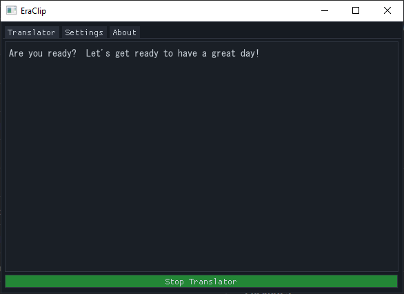

# EraClip

A **simple clipboard translator** for Era games. Just copy text and get instant English translations via DeepL - *no more suffering through moonrunes while dating Reimu!*

## Quick Start
**[Download Latest Release](https://github.com/0zl/era-clip/releases/latest/download/EraClip.exe)**

## Features

- Real-time clipboard monitoring & translation
- Language detection (JP/CN/KR)
- High-quality DeepL translations
- Smart caching to reduce API calls
- Always-on-top with transparency options
- Clean UI that doesn't butcher CJK text
- Works with all Era games *(just enable Copy to Clipboard!)*
- Bugs. More bugs.

*Built with love for `/hgg/` and `/egg/`. Feel free to contribute or whatever.*

## Why Though?

Other Era game translators are too complex for my taste. I just wanted something dead simple and quick *(and probably shittier version)*. Plus, I needed an excuse to learn Python.
